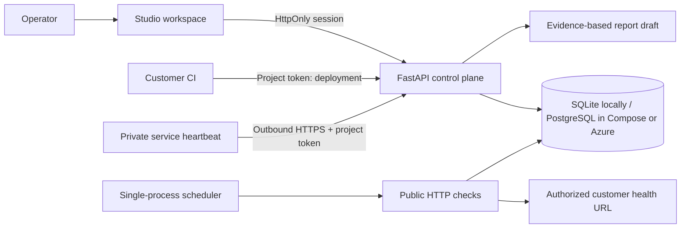

# Architecture and trust boundaries

One installed workspace belongs to one software studio. A client groups application environments. All operator sessions have workspace-wide access. Ingestion credentials are scoped to one project and cannot read the workspace or invoke recovery actions.

The API initializes database tables, serves static UI assets and runs a 30-second scheduling loop. HTTP checks execute at configured intervals; multiple probes run sequentially. Write operations and incident creation are serialized with a process lock. This deliberate MVP design needs a separate scheduler/queue before scaling beyond one process. Failures create an unresolved incident; successes do not silently close it. Resolution requires recent passing evidence after the incident opened and a human note.

Stored sample success rates count checks; they are not time-weighted uptime. Stale observations are labelled stale, never healthy. A deployment passing one URL check is not full business verification. Reports disclose these limits.

The new demo uses deterministic simulated workflow results. `app.py` preserves the earlier real synthetic invoice queue drill separately. Neither demo mutates customer infrastructure. Future execution adapters must define specific operations, preconditions, approval, verification and rollback constraints.

Azure baseline: Container Apps single replica → PostgreSQL, with configuration secrets resolved from Key Vault using a managed identity. Console output flows into Log Analytics. Application Insights is provisioned but tracing instrumentation is pending. AWS apps can send the same HTTP/heartbeat signals; no AWS account integration is claimed.
